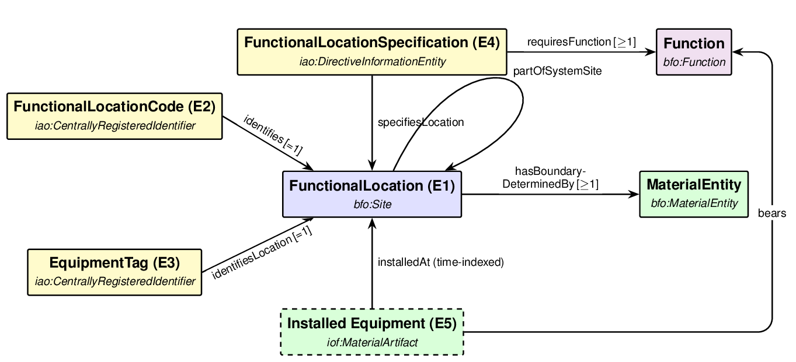

# Functional Location Ontology Design Pattern (FL-ODP)


A modular Ontology Design Pattern (ODP) for representing **Functional Locations** (*Locais de Instalação*) as persistent spatial sites in industrial asset management systems.

Functional locations are positions in an industrial facility where maintainable items are installed. A position persists independently of the equipment currently occupying it: when a separator vessel is replaced, the position remains, and the maintenance history, sensor time-series, and safety analyses accumulated at that position remain valid. This ODP provides the ontological structure to represent that persistence and the relationships among the five concerns that industrial practice keeps distinct: the position itself, its hierarchical code, its equipment tag, its engineering specification, and the transient equipment installed at it.

## The Pattern

The FL-ODP separates five independently persistent concerns, all anchored to the same `bfo:Site`:

```
Equipment Tag ──denotes──→ ┌─────────────────────┐ ←──denotes── FL Code
  (SEP-V001)                │  FunctionalLocation  │           (31242.FGAS.4110.02.01)
                            │     (bfo:Site)        │
FL Specification ──specifies→└─────────────────────┘ ←──installedAt── Equipment
  (engineering reqs)              persistent anchor          (transient physical asset)
```



| ODP Element | BFO Grounding | IDO Grounding | Role |
|:---|:---|:---|:---|
| **FunctionalLocation** | `bfo:Site` | `lis:Site` | Persistent spatial position |
| **FunctionalLocationCode** | `iao:Identifier` | `lis:InformationObject` | Hierarchical address (ISO 14224) |
| **EquipmentTag** | `iao:Identifier` | `lis:InformationObject` | Functional designation (naming convention) |
| **FunctionalLocationSpecification** | `iao:DirectiveIE` | `lis:Specified` | Engineering requirements |
| **Equipment** | `iof:PieceOfEquipment` | `lis:PhysicalObject` | Transient physical asset |

### Why `bfo:Site`?

The choice of `bfo:Site` as the grounding category results from a systematic elimination of alternatives:

| BFO Category | Persists when empty? | Spatial queries? | Hierarchy? | Relative to plant? | Verdict |
|:---|:---:|:---:|:---:|:---:|:---|
| `MaterialEntity` | No | Yes | Yes | Yes | Fails persistence |
| `Role` | No | No | No | — | Fails persistence, spatial, hierarchy |
| `ICE` | Yes | No | Partial | — | Fails spatial queries |
| `SpatialRegion` | Yes | Yes | Yes | No | Fails for floating units |
| **`Site`** | **Yes** | **Yes** | **Yes** | **Yes** | **All satisfied** |

A site's boundaries are determined *in relation to* material entities (nozzles, deck frames) but are not constituted by the equipment that occupies it, which is what allows the site to persist through equipment replacements.

### Two Identifiers, One Location

A key design decision: **neither the equipment tag nor the FL code links directly to the physical equipment**. Both denote the functional location (the position). The connection to equipment is *mediated* through the site:

```
Tag "SEP-V001" ──identifiesLocation──→ FL Site ←──installedAt── Physical Separator
Code "31242.FGAS.4110.02.01" ──identifies──→ FL Site
```

When engineers say "the equipment at SEP-V001", they mean "the equipment *currently installed at* the position denoted by SEP-V001." The `hasTag` property chain formalizes this:

```
hasTag ⊑ installedAt ∘ identifiesLocation⁻¹
```

## Key Features

- **ISO 14224 Compliance:** Five-level hierarchy (Plant → System → Subsystem → Equipment Unit → Maintainable Item) with restricting axioms enforcing level constraints.
- **Temporal Continuity:** Datasets (`TimeStampedMeasuredDataset`) and maintenance notes are indexed by the *Site*, not the *Equipment*, so data persists across equipment replacements without application-level record linkage.
- **Spatial Reasoning:** Relative coordinates (X, Y, Z) anchored to material reference frames, enabling proximity queries.
- **Equipment Type Classes:** Primitive classes with necessary conditions — classification requires domain expert assertion, not inference from function alone. This is consistent with industrial practice where the same vessel type can serve different functions depending on context.
- **Framework-agnostic core:** The five-concern separation is presented at a framework-independent level first, with two separate groundings provided: BFO/IOF and IDO (ISO CD 23726-3). Both groundings are discussed, including their respective limitations.
- **Bilingual:** Full IOF Annotation Vocabulary compliance with annotations in English and Brazilian Portuguese (*Português Brasileiro*).
- **IOF Annotations:** Natural language definitions (Aristotelian form), semi-formal definitions, first-order logic definitions, usage notes, explanatory notes, and maturity levels for all classes and properties.

## Logical Axioms

The ontology includes restricting axioms beyond simple taxonomy:

| Class | Restriction | Rationale |
|:---|:---|:---|
| `FunctionalLocation` | `hasBoundaryDeterminedBy some MaterialEntity` | Definitional — makes it a site |
| `FunctionalLocationCode` | `identifies exactly 1 FunctionalLocation` | Code uniqueness |
| `EquipmentTag` | `identifiesLocation exactly 1 FunctionalLocation` | Tag uniqueness |
| `FunctionalLocationSpecification` | `specifiesLocation some FunctionalLocation` | Spec must have a location |
| `Equipment` | `installedAt max 1 FunctionalLocation` | One place at a time |
| `SystemSite` | `partOfSystemSite some PlantSite` | ISO 14224 Level 2 → Level 1 |
| `SubsystemSite` | `partOfSystemSite some SystemSite` | ISO 14224 Level 3 → Level 2 |
| `EquipmentUnitSite` | `partOfSystemSite some SubsystemSite` | ISO 14224 Level 4 → Level 3 |
| `MaintainableItemSite` | `partOfSystemSite some EquipmentUnitSite` | ISO 14224 Level 5 → Level 4 |
| `SeparationEquipment` | `bears some SeparationFunction` | Necessary condition (universal) |
| Hierarchy levels | `AllDisjointClasses` | Five-way disjointness |

**Deliberately NOT restricted:** A functional location does not require a tag or code (it may exist at design time before these are assigned); a specification does not require a function (it may constrain physical parameters only); equipment does not require `installedAt` (it may be in a warehouse or in transit).

## Competency Questions

SPARQL queries for all competency questions are in `cqs/` and can be run against the ontology using `verify_cqs.py`.

| CQ | Question | Mechanism |
|:---|:---|:---|
| CQ1 | Which equipment is currently installed at FL `31242.FGAS.4110.02.01`? | Single join via site |
| CQ2 | Retrieve all maintenance records for an FL across 10 years and 3 equipment replacements | Join via persistent site |
| CQ3 | List all FLs within the Gas Processing subsystem | Recursive `partOfSystemSite` |
| CQ4 | Which FLs require gas-liquid separation function? | Via specification |
| CQ5 | Which equipment is within 10m of an FL? | Coordinate data on site |
| CQ6 | List all separation equipment in the production system | Equipment universal + hierarchy |
| CQ7 | Cross-source integration for a production loss event | Multi-source join via site |

## Usage Example

Instantiating a sensor replacement scenario (Turtle syntax):

```turtle
@prefix fl: <https://www.inf.ufrgs.br/ontologies/odp/functional-location#> .
@prefix xsd: <http://www.w3.org/2001/XMLSchema#> .

# The persistent site
fl:FL_PT23424_Site a fl:MaintainableItemSite ;
    fl:partOfSystemSite fl:InletSeparator_Site ;
    fl:hasCoordinateX "145.4"^^xsd:double ;
    fl:hasCoordinateY "67.8"^^xsd:double ;
    fl:hasCoordinateZ "12.6"^^xsd:double .

# Two identifiers — both denote the SITE, not the equipment
fl:Tag_PT23424 a fl:EquipmentTag ;
    fl:identifiesLocation fl:FL_PT23424_Site .

fl:Code_PT23424 a fl:FunctionalLocationCode ;
    fl:identifies fl:FL_PT23424_Site .

# Specification — prescribes requirements at the position
fl:Spec_PT23424 a fl:FunctionalLocationSpecification ;
    fl:specifiesLocation fl:FL_PT23424_Site ;
    fl:requiresFunction fl:PressureSensingFunction_1 .

# Equipment replacements — three sensors at the same site
fl:Sensor_v1 a fl:Sensor ;
    fl:installedAt fl:FL_PT23424_Site ;
    fl:installedDate "2015-01-01T00:00:00"^^xsd:dateTime ;
    fl:removedDate "2017-06-15T10:30:00"^^xsd:dateTime .

fl:Sensor_v2 a fl:Sensor ;
    fl:installedAt fl:FL_PT23424_Site ;
    fl:installedDate "2017-06-16T08:00:00"^^xsd:dateTime ;
    fl:removedDate "2022-03-10T14:20:00"^^xsd:dateTime .

fl:Sensor_v3 a fl:Sensor ;
    fl:installedAt fl:FL_PT23424_Site ;
    fl:installedDate "2022-03-11T09:15:00"^^xsd:dateTime .

# Time series — indexed by SITE, persists across sensor replacements
fl:TS_Pressure a fl:TimeStampedMeasuredDataset ;
    fl:indexedBySite fl:FL_PT23424_Site ;
    fl:storedAt "influxdb://p74/pressure/pt23424"^^xsd:anyURI .

# Maintenance note — anchored to SITE
fl:WO_2023 a fl:MaintenanceNote ;
    fl:performedAt fl:FL_PT23424_Site ;
    fl:noteText "Pressure anomaly detected at PT-23424" ;
    fl:noteTimestamp "2023-05-15T14:30:00"^^xsd:dateTime .
```

## Repository Structure

```
odp-functional-location/
├── odp-fl.ttl                  # Main ontology (Turtle)
├── odp-fl-maint.ttl            # Maintenance extension module
├── catalog-v001.xml            # Protégé catalog for local import resolution
├── imports/                    # Local copies of imported ontologies
│   ├── bfo-2020.rdf
│   ├── iao.owl
│   ├── iof-av-202602.rdf
│   ├── iof-core-202602.rdf
│   └── iof-maintenance-202602.rdf
├── cqs/                        # SPARQL competency question queries
│   ├── cq1.rq … cq7.rq
├── figures/
│   └── odp-diagram.png         # Pattern diagram
├── verify_cqs.py               # Automated CQ runner
├── CHANGELOG.md
├── LICENSE
└── README.md
```

## Alignment & Dependencies

This ontology imports and extends:

| Dependency | Role |
|:---|:---|
| [Basic Formal Ontology (BFO) 2020](http://purl.obolibrary.org/obo/bfo.owl) | Upper-level categories (Site, MaterialEntity, Function) |
| [Information Artifact Ontology (IAO)](http://purl.obolibrary.org/obo/iao.owl) | Identifier, InformationContentEntity |
| [IOF Core](https://spec.industrialontologies.org/ontology/core/Core/) | PieceOfEquipment, annotation vocabulary |
| [IOF Maintenance](https://spec.industrialontologies.org/ontology/maintenance/Maintenance/) | MaintenanceActivity |

**IDO compatibility:** A formal element-level mapping to IDO (ISO CD 23726-3) is provided in the accompanying paper. IDO is not imported — the pattern can be adopted as an IDO extension module without depending on the BFO/IOF stack.

## Related Work

The separation between a functional location and the equipment installed at it is recognized across several industrial data standards and ontologies. This ODP provides explicit OWL axioms for that separation, grounded in BFO/IOF:

- **IOF Maintenance** (IOF, 2024) — covers maintenance activities and equipment states; functional locations appear as string identifiers, with fuller modeling noted as future work.
- **Industrial Data Ontology / IDO** (ISO CD 23726-3) — provides `lis:Site` and the `Specified`/`Actual` machinery; Section 7.7 discusses the "front office" persistence problem. This ODP maps onto those constructs and extends them with OWL axioms.
- **Information Management Framework / IMF** (DNV, 2022) — introduces a conceptual separation between topology nodes (positions) and physical objects; this ODP formalizes an analogous separation in OWL.

## Contributors

Nicolau Oyhenard dos Santos · Haroldo Rojas · Cauã Roca Antunes · Fabrício H. Rodrigues · Régis Romeu · Rafael H. Petry · Mara Abel · João César Netto

Affiliations: Instituto de Informática, Universidade Federal do Rio Grande do Sul (UFRGS), Brazil · State University of New York at Buffalo (UB), USA

## Citation

If you use this ontology, please cite the repository:

> Santos, N. O. et al. (2026). *Functional Location Ontology Design Pattern (FL-ODP)*, v0.8. BDI-UFRGS. https://github.com/BDI-UFRGS/odp-functional-location

An accompanying paper is under submission. Citation details will be updated upon publication.

## License

This project is licensed under the Creative Commons Attribution 4.0 International License (CC BY 4.0) — see the [LICENSE](LICENSE) file for details.
